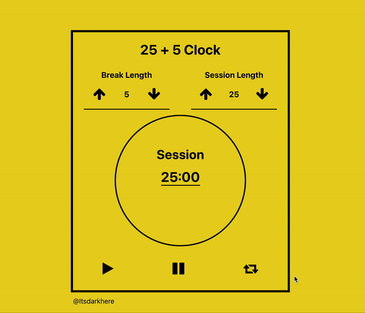

Hello Friends

This is a freecodecamp project from the track 'Frontend libraries'
 'npx create-react-app' was used to initialize.  
Built with React and some css. 

Project is imo quite self explanatory, it is a clock with a countdown that you can adjust and after the time runs out, the break timer starts... **wow**.

